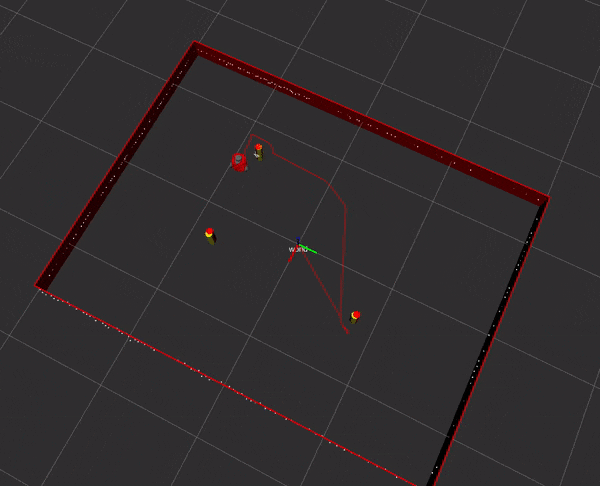

### README

#### package descripstion

This package provide a simulated robot environment, which visualize the cylinders at given start place and visulize a red turtle3-burger robot.

#### Launch file description

The launch file loads the rviz, joint_state_publier, joint_state_publisher_gui, and nusim node. Also, the yaml file for some basic configurations is loaded and xacro file for the robot is loaded.

#### parameters

In the yaml file: the current configuration is shown as below, you can change this before running the code.

```
#this is the yaml file for nusim basic_world configuration
---
robot_start: [-0.6,0.8,1.57]
cylinder_radius: 0.033
cylinders_num: 3
cylinders_start_x: [-0.7,0.3,0.4]
cylinders_start_y: [-0.8,-0.8,0.8]
# cylinders_start_x: [-0.6]
# cylinders_start_y: [-0.8]
#the length of the walls
x_length: 3
y_length: 4
#nusim_config(for debug only)
x0: 0
y0: 0
theta0: 0
rate_nusim: 30
#add the wheel noise here
wheel_mean: 0
wheel_stddev: 0.01
slip_min: 0
slip_max: 0.1
#basic_sensor_config
basic_sensor_variance: 0.01
#max_range in radius
max_range: 4
```

other parameters which used in launch file can be set is shown as below.

```
  <arg name="use_rviz" default ="false" />  //whether to display rviz
  <arg name="use_jsp" default="false" />   //whether to use joint_state publisher
  <arg name = "robot" default= "nusim"/>  //set the robot to be nusim/real_robot
  <arg name = "cmd_src" default="teleop" /> //the control resource of the robot
```

#### sample input

```
roslaunch nusim nusim.launch use_rviz:=true use_jsp:=true
```


In this scene, you will see the path of the robot, the laser scan, and red obstacles which indicate the 
the real position and the yellow obstacles indicating the fake sensor measurements.
