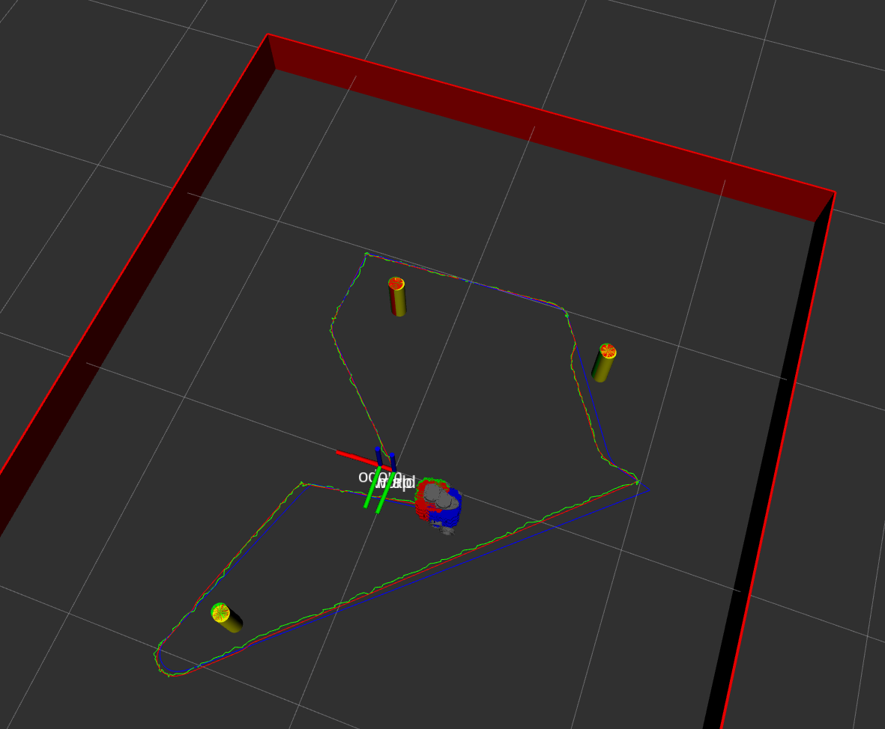

### README

#### package descripstion

This package uses extended kalman filter method to fuse the data from odometry and other measurements to 
estimate the state of the robot.

#### Launch file description

The launch file loads the basic nusim node to simulate the robot world. Also, three robots with different colors
and colored path also show up. The blue robot indicates the position of the odometry, the red robot indicates 
the position of the real robot, and the green robot indicates the estimated position of the kalmen filter.

example input of the launch file
```c
roslaunch nuslam nuslam.launch use_rviz:=true
```

launch file parameters:
cmd_src: choose from circle/teleop/none. Circle option starts the circle node and teleop starts the turtlebo3_teleop node.

use_rviz: true/false to load rviz to visualize the robot

robot: choose from nusim/localhost/<turtlebotname>/none. Nusim option starts the nusim node, and localhost start the robot in local machine, and turtlebotname starts the robot in the given name of turtlebot3.

Here's the example of the what you should see when launch file works.

