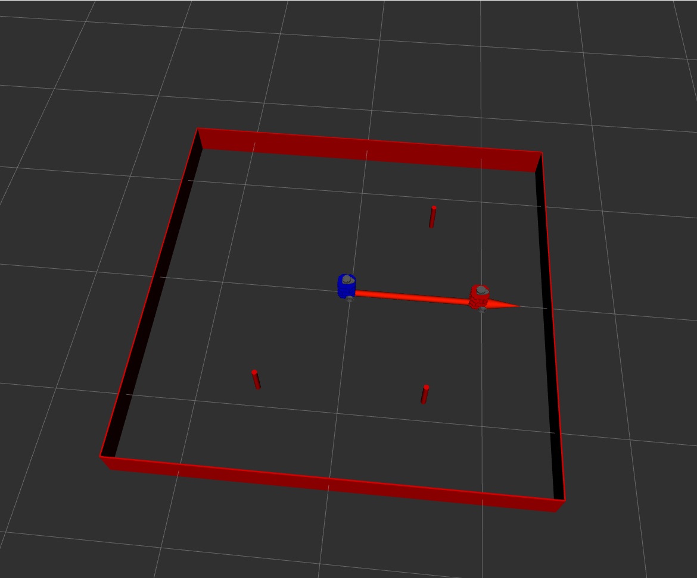
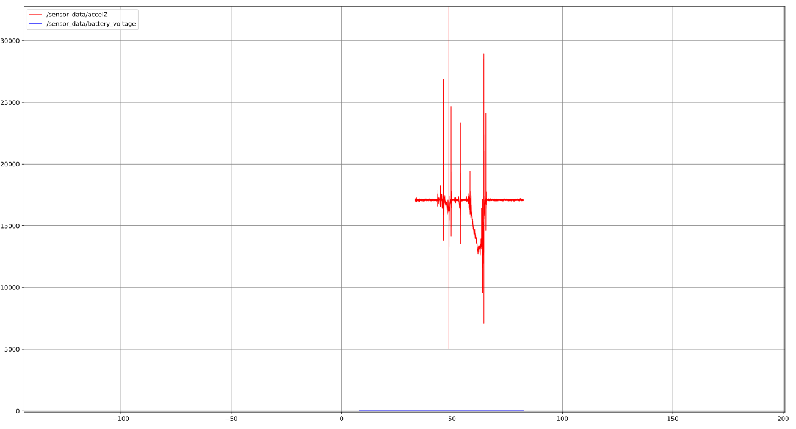
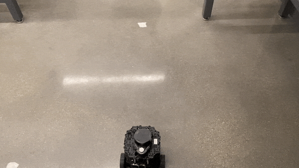
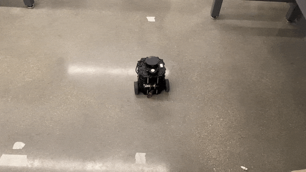
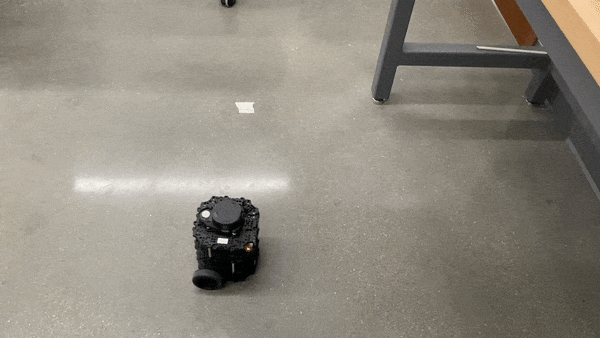
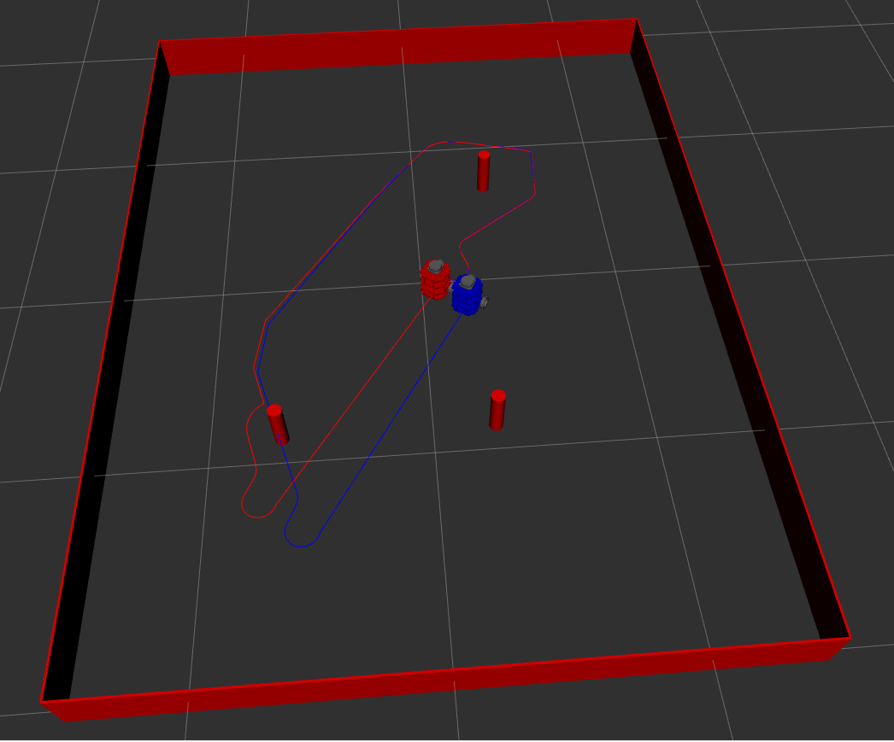

### README

#### package descripstion
This package provides the robot control interface, the circle control, and 
the odometry of the robot.

#### Launch file description
for start_robot launch file:

example input of launch file

```c
roslaunch nuturtle_control start_robot.launch use_rviz:=true
```

launch file parameters:

cmd_src: choose from circle/teleop/none. Circle option starts the circle node and teleop starts the turtlebo3_teleop node.

robot: choose from nusim/localhost/<turtlebotname>/none. Nusim option starts the nusim node, and localhost start the robot in local machine, and turtlebotname starts the robot in the given name of turtlebot3

use_rviz: true/false to load rviz to visualize the robot

frequency: the frequency to load the circle node

odom_id: the name of odometry frame

use_jsp: choose whether to load joint state publisher

x_length, y_length: the length of the obstacle wall in x and y axis

x0,y0,theta0: the start pos and direction of the red robot. The default is set to (1,0,0) to show the difference between two robot.

rate: the rate of the nusim node

Here's the example of the what you should see when launch file work at the very beginning. The red robot is set to 1,0,0 just to see the difference between two robot. When the control service is called, two robots will move at the same speed towards same direction.



The real robot experiment result

The rqt_graph of all the nodes


The rqt_plot result of the sensor data



The test of the real robot

drive robot forward and backward: 

final pos(0.172,0.026)



drive robot clockwise and counter clockwise

final pos(-0.10,0.07)



drive robot in a circle

final pos( -0.19,0.03)



if without slip, the odom works okay. However, if the radius is reduced, the  odom gets worse.



Here is the picture with two robots. The red one is the real robot position, and the blue one is the odometry position. The
red robot has wheel noise and obstacle avoidance, the odometry has just wheel noise and is not able to detect any obstacle.
